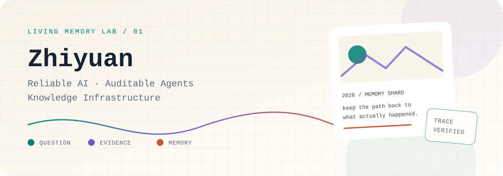
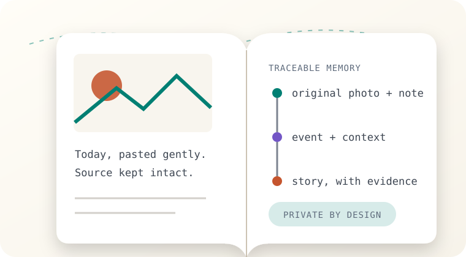
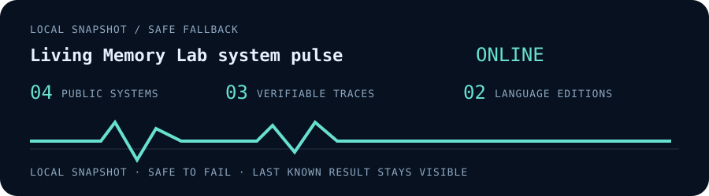

<!-- GENERATED FILE. Edit profile.config.yml and run npm run generate. -->

<picture>
  <source media="(prefers-reduced-motion: reduce) and (prefers-color-scheme: dark)" srcset="./assets/generated/hero-static-dark.svg" />
  <source media="(prefers-reduced-motion: reduce) and (prefers-color-scheme: light)" srcset="./assets/generated/hero-static-light.svg" />
  <source media="(prefers-color-scheme: dark)" srcset="./assets/generated/hero-dark.svg" />
  <source media="(prefers-color-scheme: light)" srcset="./assets/generated/hero-light.svg" />
  
</picture>

[English](./README.md) · [简体中文](./README.zh-CN.md)

### A system builder who keeps the receipts.

I build AI systems that keep goals, evidence, permissions, and acceptance criteria visible. My work connects research questions to tools, memory, and products people can actually use.

> I care about what a model can do. I care even more about why we should trust the result.

## Chronicle Memory

<table>
<tr>
<td width="54%" valign="top">

### Put today on the page, so your future self can still find it.

A private, evidence-grounded personal journal. Photos, words, moods, time, and stories live on a freeform notebook while every AI-organized memory remains traceable to its source.

**Current boundary:** Public, sanitized web experience backed by a privately deployed memory service.

<a href="https://h0ll0w-akuzr0guy.github.io/chronicle-memory-web/chronicle-memory/?utm_source=github&utm_medium=profile&utm_campaign=living-memory-lab&utm_content=chronicle-hero"><b>Open the live notebook ↗</b></a> · <a href="https://akuzr0guy.space/chronicle-memory/?utm_source=github&utm_medium=profile&utm_campaign=living-memory-lab&utm_content=chronicle-deployment">Private deployment ↗</a> · <a href="https://github.com/h0ll0w-AkuZr0guY/chronicle-memory-web">Public source ↗</a>

</td>
<td width="46%" valign="top">
<picture>
  <source media="(prefers-color-scheme: dark)" srcset="./assets/generated/chronicle-dark.svg" />
  <source media="(prefers-color-scheme: light)" srcset="./assets/generated/chronicle-light.svg" />
  
</picture>
</td>
</tr>
</table>

## Systems you can enter

<table>
<thead><tr><th>System</th><th>Why it exists</th><th>Route</th></tr></thead>
<tbody>
<tr>
  <td><strong>ScholarFlow</strong></td>
  <td>A local-first research planning assistant that turns an ambiguous topic into evidence, experiments, claims, and testable stage contracts.</td>
  <td><a href="https://h0ll0w-akuzr0guy.github.io/scholarflow-agent/?utm_source=github&utm_medium=profile&utm_campaign=living-memory-lab&utm_content=scholarflow-card"><b>Open ↗</b></a> · <a href="https://github.com/h0ll0w-AkuZr0guY/scholarflow-agent">Public source ↗</a></td>
</tr>
<tr>
  <td><strong>Aiznoyer Atlas</strong></td>
  <td>A searchable knowledge garden connecting years of notes, research writing, algorithms, and project records.</td>
  <td><a href="https://h0ll0w-akuzr0guy.github.io/?utm_source=github&utm_medium=profile&utm_campaign=living-memory-lab&utm_content=atlas-card"><b>Open ↗</b></a> · <a href="https://github.com/h0ll0w-AkuZr0guY/h0ll0w-AkuZr0guY.github.io">Public source ↗</a></td>
</tr>
<tr>
  <td><strong>Let Code in Pad</strong></td>
  <td>An offline-first knowledge tool for deep desktop authoring and lightweight tablet review.</td>
  <td><a href="https://github.com/h0ll0w-AkuZr0guY/let-code-in-pad?utm_source=github&utm_medium=profile&utm_campaign=living-memory-lab&utm_content=let-code-card"><b>Open ↗</b></a></td>
</tr>
</tbody>
</table>

## How I build for trust

<table><tr>
<td width="33%" valign="top"><strong>Reliable AI</strong> Retrieved evidence, semantic geometry, and feedback-driven checks for low-confidence outputs.</td>
<td width="33%" valign="top"><strong>Auditable Agents</strong> Goals, permissions, evidence, and acceptance criteria expressed as workflow contracts.</td>
<td width="33%" valign="top"><strong>Knowledge Infrastructure</strong> Notes, experiments, projects, and decisions organized into systems that can keep growing.</td>
</tr></table>

## Continue into the knowledge garden

The Atlas connects long-form writing, algorithm practice, and a knowledge graph extracted from more than 100 documents.

[**Enter the Atlas ↗**](https://h0ll0w-akuzr0guy.github.io/?utm_source=github&utm_medium=profile&utm_campaign=living-memory-lab&utm_content=atlas-route) · [Read the writing ↗](https://h0ll0w-akuzr0guy.github.io/writing?utm_source=github&utm_medium=profile&utm_campaign=living-memory-lab&utm_content=writing-route)

<strong>🧪 Open my lab — research questions, public work, and live metrics</strong>

### Questions currently running in the lab

- How can an autonomous agent make permissions, evidence, and acceptance boundaries explicit?
- How can semantic space and source relationships expose RAG errors that merely look correct?
- As code becomes abundant, how should human advantage shift toward framing, constraints, and verification?

### Verifiable open-source traces

| Upstream | Contribution |
|:--|:--|
| [NevaMind-AI/memUBot](https://github.com/NevaMind-AI/memUBot/pull/6) | Added Ollama and OpenAI-compatible local-model support; PR #6 merged. |
| [NevaMind-AI/memU](https://github.com/NevaMind-AI/memU/pull/369) | Submitted OneBot v11 / NapCat QQ integration and storage fixes; PR #369 under review. |
| [MonsterNone/tmall-miao](https://github.com/MonsterNone/tmall-miao) | Implemented an Android uiautomator2 version and wrote the Android operation guide. |

  

<strong>🎮 Play with my GitHub — memory shard, alter ego, and contribution snake</strong>

### PUBLIC MEMORY SHARD · 2026

> A useful memory should preserve the path back to what actually happened.
>
> Chronicle Memory design note

### Hollow Otaku Rogue, after hours

- Anime and Arknights live in the lab as easter eggs, not credentials.
- Guitar practice keeps the system builder human.
- Public memory shards are hand-selected; private Chronicle data is never queried here.

<picture>
  <source media="(prefers-color-scheme: dark)" srcset="https://raw.githubusercontent.com/h0ll0w-AkuZr0guY/h0ll0w-AkuZr0guY/gh-pages/github-contribution-grid-snake-dark.svg" />
  <source media="(prefers-color-scheme: light)" srcset="https://raw.githubusercontent.com/h0ll0w-AkuZr0guY/h0ll0w-AkuZr0guY/gh-pages/github-contribution-grid-snake.svg" />
  
</picture>

<strong>🛠️ Remix this profile — config, modules, and safe defaults</strong>

This profile is generated from `profile.config.yml`. Edit the config, run `npm run generate`, and the bilingual pages and SVG assets update together.

- [`profile.config.yml`](./profile.config.yml): identity, projects, palette, links, and module switches
- [`content/public-memories.yml`](./content/public-memories.yml): hand-approved public memory shards
- [`scripts/generate-profile.mjs`](./scripts/generate-profile.mjs): deterministic bilingual Markdown and SVG generator
- [`.github/workflows/`](./.github/workflows): profile build, metrics snapshot, and contribution snake

[**Read the remix guide ↗**](./docs/REMIX.md) · [Browse the archived profile ↗](./content/archive/README.legacy.en.md)

### [Discuss a collaboration](mailto:1213791406@qq.com?subject=Collaboration%20via%20GitHub%20profile) · [Follow on GitHub](https://github.com/h0ll0w-AkuZr0guY)

Built as a small, forkable profile engine. Public data may update automatically; private Chronicle data never enters this repository.

